# claude-pet



A tiny Claude critter that hangs out above your prompt in Claude Code. The idea comes straight from claude-cli: the same spinner words (`✻ Sprouting…`), one per prompt, now with a little guy walking around under them. When Claude is idle, it naps.

`/pet` hides or shows it.

## Install

```
/plugin marketplace add Brunonnzn/claude-pet-marketplace
/plugin install claude-pet@claude-pet-marketplace
```

Spinner word list from [shanraisshan/claude-code-best-practice](https://github.com/shanraisshan/claude-code-best-practice/blob/main/reports/claude-spinner-verbs-and-tips.md). MIT.
